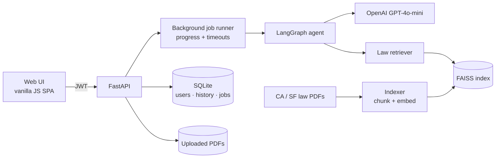
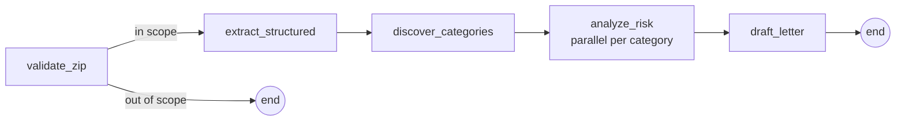

# Leazard — AI Lease Risk Analyzer

> Upload a residential lease PDF and get a cited risk report: which clauses are risky, what California / San Francisco law says about them, a 0–10 risk score, and a ready-to-send negotiation email.

Leazard is an end-to-end **LLM application**: a multi-step **LangGraph agent**, a **RAG** pipeline over real tenant law, **grounding checks** that reject hallucinated quotes and citations, an **evaluation suite**, and a **containerized FastAPI service** ready for cloud deployment.

**Built by [Ali Fardaev](https://github.com/fardaevm)** — targeting **AI / ML Engineer** roles.

---

## For Recruiters — at a Glance

| What a hiring manager looks for | Where it shows up in Leazard |
| --- | --- |
| **LLM orchestration / agents** | 5-node LangGraph state machine with conditional routing, parallel fan-out, timeouts and graceful degradation (`agent.py`) |
| **Retrieval-Augmented Generation** | PDF → chunking → OpenAI embeddings → FAISS index; top-k retrieval injected per risk category with numbered, traceable citations (`rag/`) |
| **Hallucination control** | Lease quotes must appear verbatim in the document; citations must overlap with the clause; unsupported "High" findings are automatically downgraded |
| **Evaluation** | 82 automated tests + a live **golden-set eval** that runs the real model several times and checks score stability and expected findings |
| **Deterministic scoring** | LLM outputs severities; a reproducible formula (decayed weights, squashed to 0–10, rule-based label floors/caps) produces the score |
| **Production backend** | FastAPI, JWT auth (bcrypt), SQLite/SQLAlchemy with additive migrations, async background jobs with live progress, upload validation |
| **MLOps / deployment** | Multi-stage Docker image (155 MB compressed), non-root + read-only filesystem, health checks, persistent volumes, Fly.io / Render configs |
| **Security & privacy** | Fail-fast secret checks, no lease text in logs, path-traversal guards, per-user data isolation, secrets never baked into images |

**Stack:** Python 3.12 · LangGraph · LangChain · OpenAI (GPT-4o-mini, text-embedding-3-small) · FAISS · FastAPI · SQLAlchemy · pdfplumber · pytest · Docker · Poetry

---

## What It Does

1. User registers, logs in, uploads a lease PDF and a ZIP code.
2. A background job runs the agent while the UI shows live progress ("Reading your lease" → "Checking California law" → …).
3. The result page shows:
   - **Risk score (0–10) and label** (Low / Moderate / High)
   - **Flagged clauses** with severity, the verbatim lease quote, why it matters, and **citations to the law corpus**
   - **Standard clauses** recognised as normal (so tenants aren't alarmed by boilerplate)
   - **Recommendations** and a **negotiation email** to send the landlord
4. All analyses are saved to the user's history, with the original PDF.

---

## Architecture



### The agent (LangGraph)



| Node | What it does |
| --- | --- |
| `validate_zip` | Rejects leases outside the supported region before spending any tokens |
| `extract_structured` | Splits long leases into overlapping chunks, extracts structured fields in parallel, merges results |
| `discover_categories` | LLM decides which risk areas *this* lease needs checked — nothing hard-coded |
| `analyze_risk` | For each category, in parallel: retrieve relevant law → LLM flags clauses → **verify quotes → filter citations → cap unsupported severity** → merge duplicates → deterministic score |
| `draft_letter` | Writes a negotiation email from the top issues (with a template fallback if the LLM fails) |

Each node can route to `END` on error, the whole run has a deadline, and failure of a single category degrades gracefully instead of failing the job.

---

## Engineering Highlights

### 1. Grounding and hallucination control
LLMs invent quotes and citations. Leazard does not trust model output blindly:

- **Quote verification** — every `lease_quote` is whitespace-normalised and must appear *verbatim* in the extracted lease text, or it is dropped.
- **Citation relevance filter** — the model cites retrieved chunks by number (`[1]`, `[2]`); each citation is kept only if it shares enough content words with the flagged clause (or is within a configurable vector distance).
- **Evidence-gated severity** — a finding above "Low" with no surviving citation, or one the model marks as uncertain, is automatically capped at "Low".
- **Market-norms context** — region-specific guidance (e.g. "a 21-day deposit return clause is compliant") reduces false alarms on standard clauses, while legal citations still come only from the law index.

### 2. Deterministic, explainable scoring
The model chooses severities; the **score is computed in code**: weights sorted most-severe-first, discounted by `decay^i`, squashed with `10·(1 − e^(−total/scale))`, then rule-based floors and caps (e.g. *two or more High findings ⇒ High*). Same flags → same score, always. Weights and thresholds are configurable by environment variable.

### 3. Evaluation
- **82 offline tests** (pytest) covering the agent nodes, scoring, quote/citation logic, API, auth, job lifecycle and the indexer — the LLM is mocked, so they run in ~13 s with no API cost.
- **Live golden test** (`pytest -m live`) runs the real model and law index on a sample San Francisco lease multiple times and asserts:
  - the risk label stays Low/Moderate with no High findings (no false alarms on a fair lease),
  - standard clauses (deposit, 21-day return, entry notice, insurance…) are not over-flagged,
  - the reported score matches the deterministic formula,
  - and it reports score **standard deviation and range** across runs to track LLM non-determinism.

### 4. RAG pipeline
- Law PDFs → `pdfplumber` → `RecursiveCharacterTextSplitter` (1200 / 200 overlap) → `text-embedding-3-small` → **FAISS**.
- The index is rebuilt only when it must be: a **content-hash fingerprint** (file bytes + embedding model + chunk settings) means re-deploys and fresh clones reuse the existing index instead of paying to re-embed.
- Retrieved chunks are labelled `[n] source page=…`, and a context budget ensures only citations that actually reached the model can be referenced.

### 5. Production-minded backend
- **Async jobs**: `POST /jobs` returns immediately; a bounded in-process worker pool runs the agent; `GET /jobs/{id}` reports step and progress. Per-user and global concurrency limits, a hard timeout, and jobs interrupted by a restart are marked as failed on startup.
- **Auth**: JWT (HS256, expiring) + bcrypt password hashing; every record and PDF is scoped to its owner.
- **Input safety**: PDF magic-byte check, streamed upload with size limit, scanned-PDF detection, path-traversal-proof file IDs.
- **Privacy**: exception logging records only type and stack frames — never lease content or secrets.

### 6. Containerization and deployment
- Multi-stage Dockerfile: dependencies exported from `poetry.lock` **with hash verification**, no build tools or Poetry in the runtime image.
- Runs as **non-root (UID 10001)** with a **read-only root filesystem**, all Linux capabilities dropped, exec-form entrypoint for graceful shutdown.
- Required secrets are checked at startup with a clear error, before any paid API call.
- Health checks, a single persistent volume for DB / uploads / index, and ready-made **Fly.io** and **Render** configs.

**Measured** (local Docker, Apple Silicon):

| Metric | Value |
| --- | --- |
| Image size | 719 MB on disk / 155 MB compressed |
| First start (builds the law index) | ~20 s |
| Restart (index reused) | ~1 s to healthy |
| Memory | ~130 MB idle, ~550 MB during an analysis |
| End-to-end analysis of a sample lease | ~21 s |

---

## Project Structure

```text
leazard/
├── main.py                 # FastAPI app: auth, uploads, history, background jobs
├── agent.py                # LangGraph agent, grounding checks, scoring
├── auth.py                 # JWT + bcrypt
├── db.py                   # SQLAlchemy models, additive migrations
├── rag/
│   ├── indexer.py          # PDF → chunks → embeddings → FAISS (content-hash cache)
│   ├── retriever.py        # Top-k retrieval with traceable citations
│   └── market_norms.md     # Region guidance injected into prompts
├── utils/extract_pdf.py    # Text extraction + scanned-PDF detection
├── data/law/               # California / San Francisco law corpus (PDF)
├── ui/                     # Vanilla JS single-page app (no build step)
├── tests/                  # Unit, API, job and live golden tests
├── Dockerfile · docker-compose.yml · docker-entrypoint.sh · fly.toml
└── pyproject.toml · poetry.lock
```

---

## Run Locally

```bash
git clone https://github.com/fardaevm/leazard.git
cd leazard
poetry install
cp .env.example .env          # set OPENAI_API_KEY and SECRET_KEY (openssl rand -hex 32)
poetry run uvicorn main:app --reload
```

Open http://localhost:8000.

### Tests

```bash
poetry install --with dev
poetry run pytest                         # offline suite, LLM mocked
poetry run pytest -m live -s tests/test_golden.py   # real model + law index (uses API credits)
```

---

## Run with Docker

Requires Docker with Compose v2. Put `OPENAI_API_KEY` and `SECRET_KEY` (≥32 chars, `openssl rand -hex 32`) in `.env` (see `.env.example`).

```bash
docker compose up -d --build        # build + run on http://localhost:8000
docker compose logs -f              # first start embeds the law corpus (~20 s)
```

Plain Docker: `docker build -t leazard .` then `docker run --env-file .env -p 8000:8000 -v leazard-data:/data leazard`.

**Data** lives in the named volume `leazard-data`, mounted at `/data`: `leaze.db` (users, history, jobs), `uploads/` (PDFs), `rag_store/` (FAISS index, rebuilt only when the law PDFs or embedding settings change).

```bash
# Backup (stop first so SQLite is consistent)
docker compose stop
docker run --rm -v leazard-data:/data -v "$PWD":/backup debian:trixie-slim tar czf /backup/leazard-data.tgz -C /data .
docker compose start
# Reset everything (deletes all accounts, history and uploads)
docker compose down -v
```

The app runs as UID 10001 with a read-only root filesystem, and always with a **single** uvicorn worker (jobs run in-process).

## Deploy

### Fly.io

`fly.toml` is included (1 machine, `shared-cpu-1x` / 1 GB, volume at `/data`, health check on `/health`).

```bash
fly launch --no-deploy --copy-config          # pick a unique app name / region
fly volumes create leazard_data --size 1 --region sjc
fly secrets set OPENAI_API_KEY=sk-... SECRET_KEY=$(openssl rand -hex 32)
fly deploy --ha=false                         # one machine: SQLite + in-process jobs
```

The container starts as root only to chown the root-owned volume, then drops to UID 10001.

### Render

Create a **Web Service** from the repo with runtime **Docker** (Dockerfile at repo root). Add a **Persistent Disk** mounted at `/data` (paid instance type, 1 GB is plenty), set `OPENAI_API_KEY` and `SECRET_KEY` as environment variables, and set the health check path to `/health`. Render injects `PORT`; the image honours it. Keep it to one instance: a disk-backed service can't scale out, and jobs are in-process.

---

## Design Decisions and Trade-offs

| Decision | Why | Trade-off / next step |
| --- | --- | --- |
| LangGraph instead of one big prompt | Each step is testable, observable and can fail independently | More orchestration code |
| Score computed in code, not by the LLM | Reproducible, explainable, tunable without re-prompting | Severity labels still come from the model |
| FAISS on disk instead of a vector DB | Zero infrastructure for a small, static corpus | Move to pgvector / Qdrant for multi-region corpora |
| In-process job queue + SQLite | Simple to run and deploy on one small VM | Single worker; Redis/Celery + Postgres to scale out |
| GPT-4o-mini at temperature 0 | Low cost and latency; variance tracked by the golden eval | Could A/B larger models on the eval set |

## Roadmap

- Larger labelled eval set (precision / recall of flagged clauses, citation accuracy)
- LLM tracing and cost/latency dashboards (LangSmith or OpenTelemetry)
- CI/CD with GitHub Actions: tests + image build on every PR
- OCR for scanned leases; more jurisdictions beyond San Francisco
- Hybrid retrieval (BM25 + vectors) and a re-ranker

---

> Leazard is a portfolio project, not legal advice.

**Author:** Ali Fardaev — AI / ML Engineer · Data Scientist · MLOps · [GitHub](https://github.com/fardaevm/leazard)
