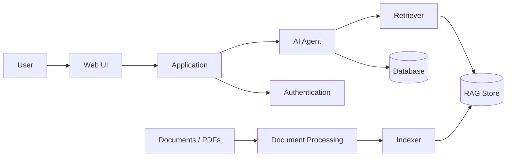
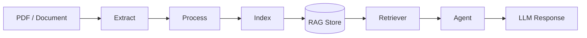

# Leazeard

> **Agentic AI application combining LLM orchestration, RAG, document processing, authentication, and a modular Python backend.**

Leazeard is an end-to-end AI system built to explore the engineering patterns behind modern **AI agents and RAG applications** — from document ingestion and retrieval to agent orchestration, application state, and a user-facing interface.

**Built for:** AI/ML Engineering · ML Engineering · MLOps · LLM Applications

---

## Architecture



### Request flow

```text
User
 ↓
Web Interface
 ↓
Application
 ↓
Agent
 ├── Retrieval ──→ RAG Store
 ├── Database
 └── Application Context
 ↓
LLM
 ↓
Response
```

---

## What It Demonstrates

| Area                | Implementation                          |
| ------------------- | --------------------------------------- |
| **Agentic AI**      | Agent-based orchestration               |
| **RAG**             | Dedicated indexing + retrieval pipeline |
| **Document AI**     | PDF extraction / ingestion              |
| **Backend**         | Modular Python application              |
| **Data Layer**      | Application database                    |
| **Authentication**  | Dedicated auth module                   |
| **Frontend**        | Lightweight HTML/CSS interface          |
| **Environment**     | Poetry + locked dependencies            |
| **Version Control** | Git / GitHub                            |

---

## Project Structure

```text
leazard/
│
├── agent.py              # AI agent / orchestration
├── main.py               # Application entry point
├── auth.py               # Authentication
├── db.py                 # Database layer
│
├── rag/
│   ├── indexer.py        # Document indexing
│   └── retriever.py      # Retrieval
│
├── utils/
│   └── extract_pdf.py    # PDF extraction
│
├── ui/
│   ├── index.html        # Web interface
│   └── css/style.css
│
├── pyproject.toml        # Project + dependencies
├── poetry.lock           # Reproducible dependency versions
└── .gitignore
```

---

## RAG Pipeline



The retrieval layer is intentionally separated into:

* **Indexing** — preparing and storing document information
* **Retrieval** — finding relevant context at query time
* **Agent** — using retrieved context as part of the application workflow

This separation makes individual components easier to replace, evaluate, and extend.

---

## Engineering Highlights

### Modular AI architecture

AI orchestration is separated from:

```text
Retrieval
Persistence
Authentication
Document processing
Presentation
```

This keeps application infrastructure from becoming tightly coupled to the AI layer.

### Reproducible environment

Dependencies are managed with **Poetry** and committed through `poetry.lock`.

```bash
poetry install
```

### Security-conscious repository

Local secrets and application state are excluded from Git:

```text
.env
*.db
uploads/
data/
rag_store/
__pycache__/
```

This keeps credentials and local/generated artifacts out of the public repository.

---

## Run Locally

### Clone

```bash
git clone https://github.com/fardaevm/leazard.git
cd leazard
```

### Install

```bash
poetry install
```

### Configure

Create your local environment configuration:

```bash
cp .env.example .env
```

Add the required API keys/configuration.

### Run

```bash
poetry run python main.py
```

---

## Tech Stack

**Python** · **LLM/Agents** · **RAG** · **Poetry** · **SQLite** · **HTML/CSS** · **Git**

---

## Engineering Roadmap

The architecture provides a foundation for adding production AI infrastructure such as:

```text
Evaluation
    ↓
Tracing / Observability
    ↓
Automated Tests
    ↓
CI/CD
    ↓
Docker
    ↓
Cloud Deployment
    ↓
Production Monitoring
```

Potential next steps:

* RAG retrieval evaluation
* LLM response evaluation
* Agent/tool-call tracing
* Automated regression tests
* CI/CD with GitHub Actions
* Dockerized deployment
* Model/provider abstraction
* Retrieval and latency monitoring

---

## Why Leazeard?

A basic LLM application looks like:

```text
Prompt → LLM → Response
```

Leazeard focuses on the larger engineering system:

```text
                    ┌── Retrieval
                    │
User → Application → Agent ── Database
                    │
                    ├── Auth
                    │
                    └── Documents
                           ↓
                          LLM
                           ↓
                        Response
```

The project demonstrates how **AI capabilities can be integrated into a maintainable software architecture**, rather than treating the LLM as an isolated API call.

---

### Repository

**GitHub:** https://github.com/fardaevm/leazard

**Author:** Ali Fardaev
AI / ML Engineer · Data Scientist · MLOps
