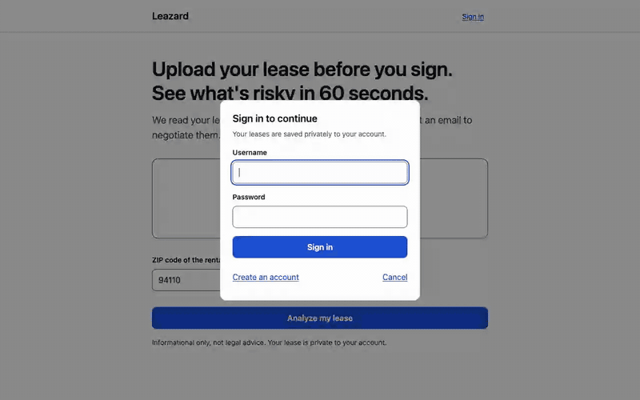
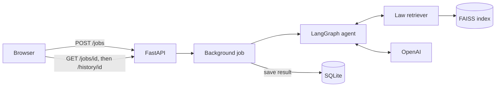
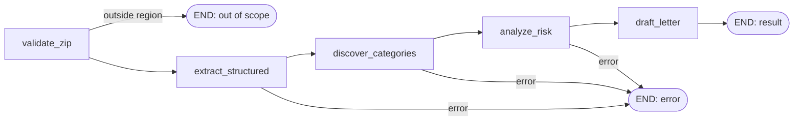

<h1 align="center">Leazard</h1>

<p align="center">
  Upload a residential lease before you sign. Get a cited risk report, a 0-10 score, and a ready-to-send negotiation email.
</p>

<p align="center">
  
  
  
  
</p>

<p align="center">
  
</p>

<p align="center">
  <a href="#quick-start">Quick start</a> ·
  <a href="#screenshots">Screenshots</a> ·
  <a href="#how-it-works">How it works</a> ·
  <a href="#how-it-was-built">How it was built</a>
</p>

---

## What is Leazard?

Most renters sign a lease they can't fully evaluate. They don't know which clauses are normal and which could cost them money. Leazard reads the lease for them:

- It **flags risky clauses** and quotes the exact lease text.
- It **checks each one against tenant law** and cites the source.
- It **drafts an email** to the landlord about the issues it found.

It is for renters who want a second opinion before signing. Today it supports **San Francisco / California Bay Area** ZIP codes.

*Informational only, not legal advice.*

### Highlights

- **A 5-step LangGraph agent**, not one big prompt. Each step can be tested on its own ([`agent.py`](agent.py)).
- **Grounded output.** Quotes must appear word for word in the lease. Findings rated above Low need a supporting law citation, or they are capped at Low.
- **The score is computed in code.** The same findings always give the same score ([`score_flags`](agent.py)).
- **Tested.** There are 82 offline tests, plus a live "golden lease" test against the real model.

## Tech stack

| Layer | Tools |
| --- | --- |
| AI | LangGraph, OpenAI GPT-4o-mini, `text-embedding-3-small` |
| Retrieval | FAISS (vector index), pdfplumber (PDF text) |
| Backend | FastAPI, SQLAlchemy, SQLite, JWT + bcrypt |
| Frontend | Vanilla JavaScript, no build step |
| Ops | Docker, Fly.io / Render, pytest, Poetry |

## Quick start

You need Docker and an OpenAI API key.

```bash
git clone https://github.com/fardaevm/leazard.git && cd leazard
cp .env.example .env
echo "OPENAI_API_KEY=sk-your-key-here" >> .env
echo "SECRET_KEY=$(openssl rand -hex 32)" >> .env
docker compose up -d --build
```

Open **http://localhost:8000**. The first start builds the law index, which took about 18 seconds in our test. Later starts take about 1 second. To try it, upload [`tests/golden/sample_sf_lease_agreement.pdf`](tests/golden/sample_sf_lease_agreement.pdf) with ZIP `94110`.

<details>
<summary><b>Run without Docker</b></summary>

Requires Python 3.12 and [Poetry](https://python-poetry.org/).

```bash
poetry install
cp .env.example .env   # then set OPENAI_API_KEY and SECRET_KEY (openssl rand -hex 32)
poetry run uvicorn main:app --reload
```

</details>

<details>
<summary><b>Run the tests</b></summary>

```bash
poetry install --with dev
poetry run pytest                                    # 82 offline tests, LLM mocked, ~13 s
poetry run pytest -m live -s tests/test_golden.py    # real model + law index, 3 runs, uses API credits
```

</details>

## How it works

**Request path.** Uploading returns right away. The analysis runs as a background job, and the page polls it for progress.



**The agent.** Five steps. Any of them can stop the run early.



- **validate_zip** stops early if the ZIP is outside the supported region, before any AI calls.
- **extract_structured** reads the lease into fields like rent, deposit and dates. Long leases are split into parts and read in parallel.
- **discover_categories** lets the model pick which topics this lease needs checked. Nothing is hard-coded.
- **analyze_risk** checks each topic in parallel. It retrieves relevant law, flags clauses, verifies quotes and citations, and computes the score.
- **draft_letter** writes the email to the landlord. If the model fails, it falls back to a template.

## How it was built

<details>
<summary><b>Why LangGraph instead of one big prompt</b></summary>

A single prompt that "reads the lease and finds problems" is hard to test and fails all at once. With LangGraph, each step is a plain Python function with typed state. Each step can be unit-tested with a fake model and reports its own progress. A failure in one topic doesn't sink the whole run: if one category fails, it is skipped and counted, and the rest of the report still appears. The whole run also has a deadline (`JOB_TIMEOUT_S`).

</details>

<details>
<summary><b>Grounding: quotes, citations, and capped findings</b></summary>

Models invent quotes and citations, so the code checks every flag:

1. **Quote check.** Whitespace is normalized, and the quote must appear word for word in the lease text. If it doesn't, it is removed.
2. **Citation check.** Retrieved law chunks are numbered `[1]`, `[2]`, … in the prompt, and the model cites by number. A citation is kept only if it shares enough content words with the flagged clause.
3. **Severity cap.** A finding above **Low** with no surviving citation, or one the model itself marks "Uncertain", is capped at **Low** and labeled "Uncertain".

The flag in screenshot 4 is a real example: its citation didn't pass the check, so it stayed Low.

</details>

<details>
<summary><b>Scoring: same flags, same score</b></summary>

The model picks a severity for each clause (`OK`, `Low`, `Medium`, `High`). The score is computed in code:

```text
weights   OK=0, Low=0.5, Medium=1.5, High=3, sorted largest first
total     = Σ weightᵢ × 0.85ⁱ
score     = 10 × (1 − e^(−total / 10))
then      no Medium/High → Low;  one High → at least Moderate;  two+ High → High
```

Real outputs of `score_flags`:

| Flags | Score | Label |
| --- | --- | --- |
| 10 × OK | 0.0 | Low |
| 2 × Low | 0.9 | Low |
| 1 Medium, 2 Low | 2.0 | Low |
| 1 High | 3.0 | Moderate |
| 1 High, 2 Medium | 4.1 | Moderate |
| 2 × High | 6.0 | High |

Weights and thresholds can be set through environment variables (see [`.env.example`](.env.example)).

</details>

<details>
<summary><b>RAG: the law index</b></summary>

RAG (retrieval-augmented generation) means the model gets relevant law passages in its prompt instead of relying on memory.

```text
data/law/*.pdf → pdfplumber → 1,200-char chunks (200 overlap) → text-embedding-3-small → FAISS
```

The two San Francisco law PDFs produce 637 chunks. The index is saved to disk with a **fingerprint**: a SHA-256 hash of the PDF contents, the embedding model and the chunk settings. The index is rebuilt only when that fingerprint changes. Re-deploys and fresh clones reuse it instead of paying to embed the PDFs again.

</details>

<details>
<summary><b>Evaluation: offline tests and the golden lease</b></summary>

- **82 offline tests** (`poetry run pytest`, ~13 s) cover the agent steps, scoring, quote and citation checks, the API, auth, the job lifecycle, and the index fingerprint. The model is mocked, so the tests are free and don't depend on model output.
- **Golden lease test** (`pytest -m live`). It runs the real model three times on [a fair sample lease](tests/golden/sample_sf_lease_agreement.pdf) and asserts:
  - the label is Low or Moderate, with no High flags;
  - standard clauses (deposit, 21-day return, entry notice, insurance, governing law) are not over-flagged;
  - the stored score matches `score_flags`.

  Latest run: scores **0.9, 1.2, 0.9** (standard deviation 0.14).

</details>

<details>
<summary><b>Backend and security choices</b></summary>

- **Async jobs.** `POST /jobs` returns a job ID right away, and a bounded thread pool runs the agent. There is one active job per user, a global limit, and a timeout. Jobs cut off by a restart are marked failed on the next start.
- **Auth.** Passwords are hashed with bcrypt, and sessions use expiring JWTs. Every lease and PDF is scoped to its owner.
- **Uploads.** The server checks the `%PDF-` header and streams the upload with a 10 MB limit. It detects scanned PDFs and uses random hex file IDs, so there is no path traversal.
- **Privacy.** Errors are logged as type and stack only, never lease text or secrets.
- **Container.** The image is multi-stage and dependencies are hash-checked from `poetry.lock`. It runs as non-root (UID 10001) with a read-only root filesystem and all capabilities dropped. If `OPENAI_API_KEY` or `SECRET_KEY` is missing, it fails fast with a clear message. It runs a single worker on purpose, because jobs run in-process.

</details>

<details>
<summary><b>Calibration lesson: a fair lease once scored 10/10</b></summary>

The first version ([`2b82e61`](https://github.com/fardaevm/leazard/commit/2b82e61)) had no "OK" severity. Every clause the model mentioned was at least Low (weight 1), and the score was `min(10, total / 2)`. A fair lease with 20 ordinary clauses scored **10/10**.

Three changes fixed it:

1. **An `OK` severity and a rubric** in the prompt: "a clause being present is not a risk."
2. **Market-norms context** ([`rag/market_norms.md`](rag/market_norms.md)) tells the model what is typical in San Francisco. For example, a 21-day deposit return clause is compliant.
3. **A capped, decaying score** with label rules. Today, 20 Low flags score 2.7, not 10.

The golden lease test now guards against a regression.

</details>

## Deploy

<details>
<summary><b>Fly.io</b></summary>

[`fly.toml`](fly.toml) is included: one `shared-cpu-1x` machine with 1 GB of memory, a volume at `/data`, and a `/health` check.

```bash
fly launch --no-deploy --copy-config          # choose a unique app name and region
fly volumes create leazard_data --size 1 --region sjc
fly secrets set OPENAI_API_KEY=sk-... SECRET_KEY=$(openssl rand -hex 32)
fly deploy --ha=false                         # one machine: SQLite + in-process jobs
```

The container starts as root only to hand the volume to UID 10001, then drops privileges.

</details>

<details>
<summary><b>Render</b></summary>

1. Create a **Web Service** from the repo with runtime **Docker**.
2. Add a **Persistent Disk** mounted at `/data`. This needs a paid instance; 1 GB is enough.
3. Set `OPENAI_API_KEY` and `SECRET_KEY` as environment variables.
4. Set the health check path to `/health`.
5. Keep one instance. Render sets `PORT`, and the image uses it.

</details>

<details>
<summary><b>Data, backup and reset (Docker)</b></summary>

Everything lives in the `leazard-data` volume at `/data`: `leaze.db` (accounts, history, jobs), `uploads/` (PDFs) and `rag_store/` (the index).

```bash
docker compose stop
docker run --rm -v leazard-data:/data -v "$PWD":/backup debian:trixie-slim tar czf /backup/leazard-data.tgz -C /data .
docker compose start
docker compose down -v      # reset: deletes all accounts, history and uploads
```

</details>

## Roadmap

- A larger labeled set of leases, with precision and recall for flagged clauses
- Tracing and cost/latency dashboards for LLM calls
- CI with GitHub Actions: tests and an image build on every pull request
- OCR for scanned leases
- More cities and states

<details>
<summary><b>Project structure</b></summary>

```text
leazard/
├── main.py                 FastAPI app: auth, uploads, history, background jobs
├── agent.py                LangGraph agent, grounding checks, scoring
├── auth.py                 JWT + bcrypt
├── db.py                   SQLAlchemy models
├── rag/
│   ├── indexer.py          PDF → chunks → embeddings → FAISS (fingerprint cache)
│   ├── retriever.py        Top-k retrieval with numbered citations
│   └── market_norms.md     Regional "what is typical" guidance
├── utils/extract_pdf.py    PDF text extraction, scanned-PDF check
├── data/law/               San Francisco law PDFs (the RAG corpus)
├── ui/                     Vanilla JS single-page app
├── tests/                  Offline tests + live golden lease test
├── scripts/                Screenshot and GIF capture
├── docs/                   README images
└── Dockerfile, docker-compose.yml, fly.toml, pyproject.toml, poetry.lock
```

</details>

## License

No license file yet, so all rights are reserved by default. Open an issue if you'd like to reuse the code.

## Author

**Ali Fardaev**
